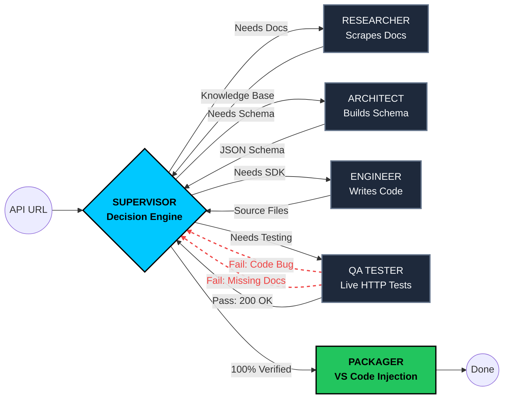

<h1 align="center"> SDKGen</h1>

<p align="center">
  <strong>Turn any API documentation URL into a fully-typed, live-tested SDK.</strong><br>
   
</p>

<p align="center">
  
  
  
  
  
</p>

---

## 🚀 What is SDKGen?

**SDKGen** is an agentic, multi-agent LLM system that eradicates the developer integration tax. 

Instead of spending 3–7 hours manually reading docs, writing boilerplate HTTP clients, defining type models, and debugging integration errors, a developer simply opens any API documentation page in Chrome and clicks the SDKGen extension.

Behind the scenes, our autonomous engineering team reads the docs, writes the code, **tests it against the live API internet**, auto-fixes any bugs, and injects the finished, fully-typed SDK directly into the developer's active VS Code workspace.

No copy-paste. No OpenAPI spec required. No manual HTTP wiring.

---

## 🧠 The Architecture (Hub-and-Spoke)

SDKGen uses a non-linear **LangGraph State Machine**. Unlike standard linear LLMs (like ChatGPT or Claude) which have no agency, SDKGen operates as a self-healing engineering team.

All communication routes through the **Supervisor**. No agent talks directly to another.



### The 6 Agents:
1. **Supervisor:** The central brain. Reads state and decides which agent acts next.
2. **Researcher:** Plans the crawl and uses Playwright to build a knowledge base from HTML.
3. **Architect:** Converts human prose into strict Pydantic JSON schemas.
4. **Engineer:** Generates models, client code, and tests. Auto-repairs syntax errors.
5. **QA Tester:** Executes real HTTP requests against the live API to prove the code works. 
6. **Packager:** Triggers ElevenLabs narration and injects the files into VS Code via WebSockets.

---

## 🛠️ Tech Stack

- **Backend:** Python 3.11, FastAPI, Uvicorn
- **AI / Agentic:** LangGraph, LangChain, Gemini 1.5 Pro, Gemini 1.5 Flash
- **Web Scraping:** Playwright (async headless Chromium), BeautifulSoup4
- **Testing:** `httpx` (async) with built-in safety blocks
- **Voice / Audio:** ElevenLabs TTS (`eleven_flash_v2`) & Conversational AI Agents
- **Frontend / Bridge:** Chrome Extension (Manifest V3), VS Code Extension (TypeScript), Server-Sent Events (SSE), WebSockets.
- **Presentation:** Gamma 4

---

## 📂 Project Structure

```text
SDKGen/
├── backend/                  # FastAPI server and LangGraph agents
│   ├── agents/               # Supervisor, Researcher, Architect, Engineer, QA, Packager
│   ├── graph/                # LangGraph StateGraph compilation and Router
│   ├── tools/                # Playwright scraper, HTTP executor, ElevenLabs
│   └── prompts/              # System prompts for all agents
├── chrome-extension/         # Chrome Popup UI and Content Scraper
│   ├── popup/                # Dark terminal UI and SSE streaming
│   └── lib/                  # WebSocket/URI Bridge protocol
└── vscode-extension/         # VS Code integration
    └── src/                  # Webview panel, File Writer, WebSocket server
```

---

## 💻 Running the Project Locally

### 1. Start the Backend
You will need a Gemini API key. ElevenLabs is optional for the voice features.

```bash
cd backend
python -m venv venv && source venv/bin/activate
pip install -r requirements.txt

# Create a .env file:
# GEMINI_API_KEY=your_key_here
# ELEVENLABS_API_KEY=optional_key

uvicorn main:app --reload
```
*The backend will run on `http://localhost:8000`*

### 2. Load the Chrome Extension
1. Open Chrome and navigate to `chrome://extensions`.
2. Turn on **Developer mode** (top right).
3. Click **Load unpacked** and select the `chrome-extension/` directory.

### 3. Load the VS Code Extension
```bash
cd vscode-extension
npm install
npx tsc
```
*Open the `vscode-extension` folder in VS Code and press **F5** to launch the Extension Development Host.*

---

## ⚡ Demo Targets

SDKGen was built to handle both modern APIs and the "un-spec'd web":
- **Modern Complex:** Stripe API (Nested JSON objects, complex pagination).
- **Classic Hacks:** OpenWeatherMap API (Missing auth headers, large single-page dumps).
- **The "Bad Docs":** Old XML-based logistics APIs or poorly structured finance documentation pages.

---

*Eliminating the integration tax, one API at a time.*
