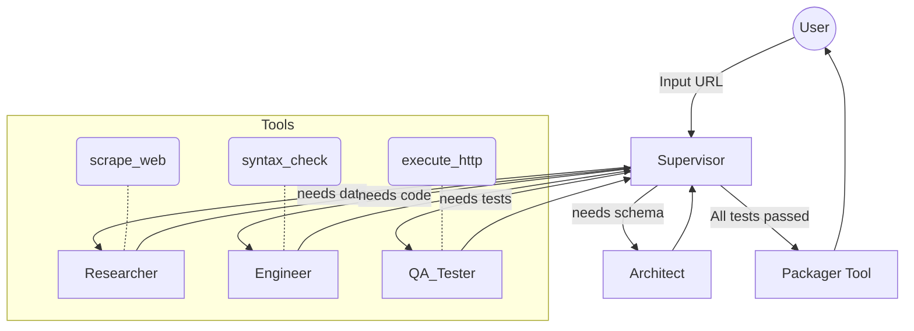

# "WOW Factor" Agentic Architecture (LangGraph)

You are completely right. To win an **Agentic Hackathon**, a simple loop isn't enough. We need to build something that feels genuinely intelligent, autonomous, and non-linear. 

We will upgrade the system from a pipeline to an **API Implementation Squad** using the **LangGraph Supervisor Multi-Agent Pattern**. 

In this architecture, there is no fixed pipeline. Instead, a Supervisor Agent delegates tasks to specialized sub-agents. These agents use **Tools** to do their jobs, talk to each other, and decide what to do next based on the outcome.

## The Multi-Agent Squad

1. 🧠 **Supervisor Agent (The Boss):** Receives the request ("Build a Python SDK for URL") and delegates tasks. It reads the current state and decides who needs to act next, or if the job is finished.
2. 🕵️ **Researcher Agent:** Equipped with a `scrape_web` tool. It doesn't just blindly scrape; it reads the landing page, decides which sub-links to follow, and builds a knowledge base.
3. 📐 **Architect Agent:** Reads the research and uses a `validate_schema` tool. If the schema has logical flaws (e.g., a GET request with a body), it fixes it autonomously.
4. 💻 **Engineer Agent:** Writes the actual SDK code. Equipped with a `syntax_check` tool to instantly verify its own code before passing it on.
5. 🧪 **QA Tester Agent (The Wow Factor):** This agent doesn't just write tests—it has an `execute_http_request` tool. It actually **pings the live API endpoints** (if safe) or runs an isolated test environment. 

## The Non-Linear Magic (Why this wins hackathons)

Because this is a graph controlled by LLMs, the flow is completely dynamic:
- **Scenario A (Happy Path):** Supervisor → Researcher → Architect → Engineer → QA → FINISH.
- **Scenario B (The Agentic "Wow" Path):**
  1. The Engineer writes the code.
  2. The QA Agent tries to run the test. It gets a `404 Not Found`.
  3. The QA Agent tells the Supervisor: "The endpoint `/post` failed."
  4. The Supervisor routes *back to the Researcher* and says, "Check the docs again for the exact post endpoint."
  5. The Researcher uses its tool, realizes the endpoint is actually `/posts` (plural).
  6. The Supervisor routes to the Engineer to fix the code, then back to QA to test again.

**This is true autonomous reasoning.** The agents are collaborating to solve an unexpected problem without human intervention.

## LangGraph Architecture Details



### The State Object
Instead of manually passing strings, the LangGraph state is simply a **Message History** and a scratchpad. The agents communicate by appending messages to the state.
```python
class AgentState(TypedDict):
    messages: Annotated[Sequence[BaseMessage], operator.add]
    next: str  # The next agent to route to
    files: dict  # The generated code files
```

## User Review Required

> [!CAUTION]  
> **Complexity Warning**
> Building a true multi-agent system with live tool calling is significantly harder than a linear pipeline. We will need to:
> 1. Use `langchain-google-genai` to enable `bind_tools()`.
> 2. Write actual Python functions for the tools (e.g., a safe HTTP request executor for the QA agent).
> 3. Write strong system prompts for the Supervisor so it doesn't get stuck in infinite loops.

**Question for you:**
Do we want the QA Agent to actually try making live HTTP requests to the target API to prove the SDK works (this is a MASSIVE wow factor for a demo), or should we stick to syntax-checking tools?

Let me know if this hits the "Wow Factor" you are looking for. If you say yes, I will immediately start writing the LangGraph Multi-Agent system.
