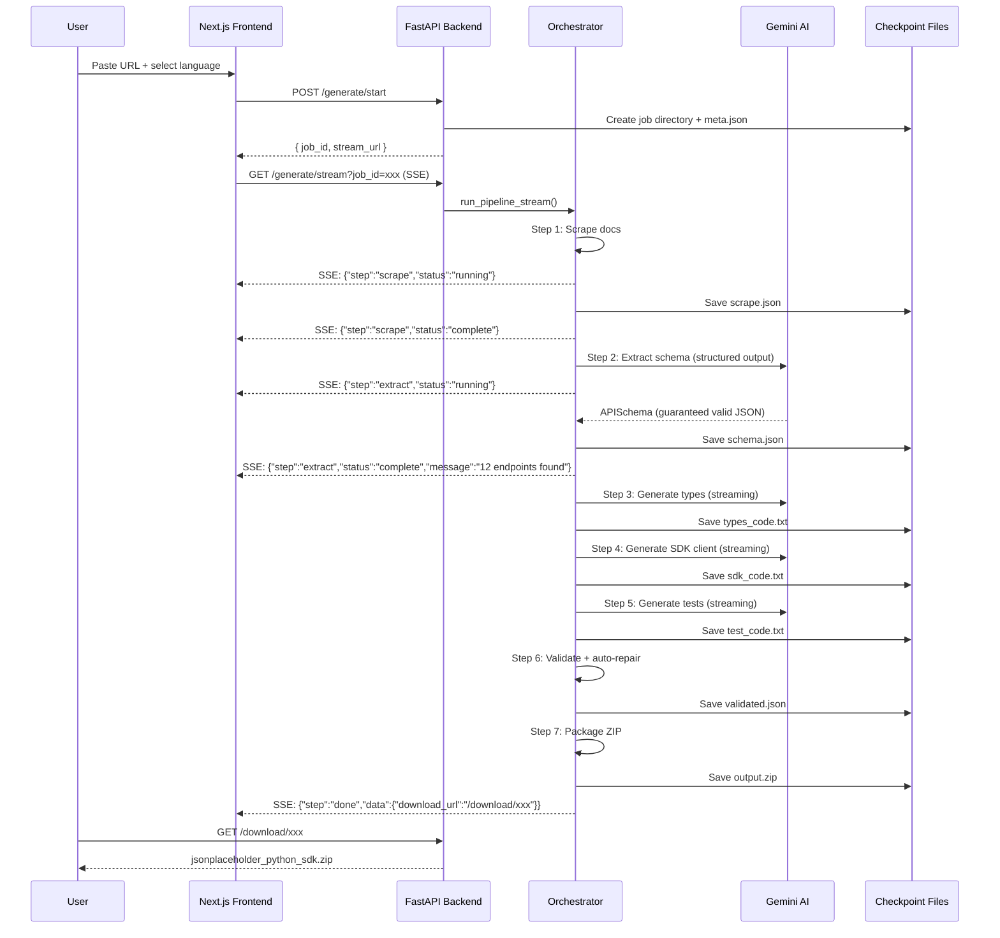
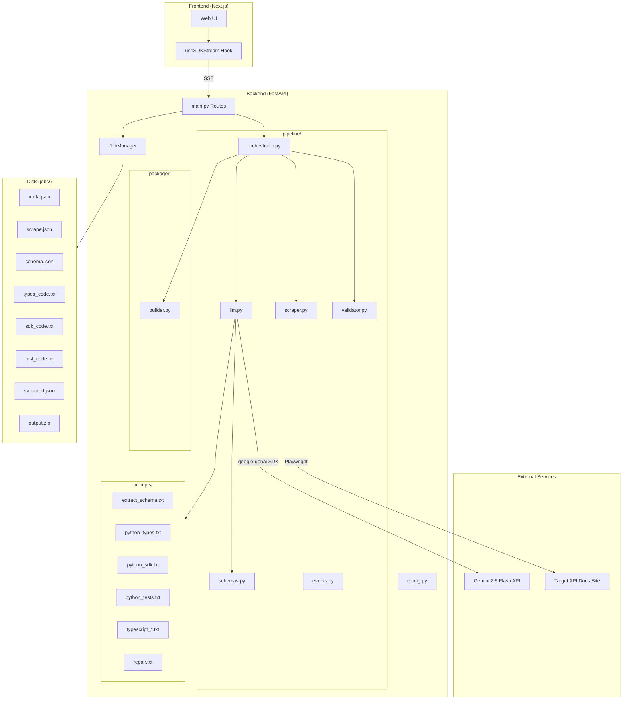

# SDKGen — Complete Project Architecture

## What It Does

**SDKGen turns any API documentation page into a ready-to-use, typed, tested SDK — in under 60 seconds.**

A developer pastes a URL like `https://jsonplaceholder.typicode.com/guide` into the web UI, picks Python or TypeScript, clicks "Generate", and watches in real-time as the system:

1. Scrapes the docs page
2. Reads the text with AI and extracts every endpoint
3. Generates type definitions
4. Generates a full client library
5. Generates a test suite
6. Validates the code for syntax errors (auto-repairs if broken)
7. Packages everything into a downloadable ZIP

The user downloads the ZIP, runs `pip install -e .`, and has a working SDK.

---

## The Problem It Solves

Every time a developer integrates a new API, they spend **2-4 hours**:
- Reading documentation
- Writing HTTP client boilerplate
- Defining request/response types
- Adding error handling
- Writing tests
- Repeating it all if they need another language

SDKGen reduces this to **~60 seconds**. No OpenAPI spec required — just the docs URL.

---

## End-to-End User Flow



---

## System Architecture



---

## Every Component Explained

### 1. Frontend (`frontend/`)

> **Status:** Skeleton exists, Dev 4 builds this

- **Next.js** app with a single-page UI
- User enters a URL + picks Python/TypeScript
- On submit: `POST /generate/start` → gets `job_id`
- Opens an `EventSource` (SSE) connection to `/generate/stream?job_id=xxx`
- Renders a **live terminal** showing each step's progress
- When `step=done`, shows a **download button**

**Key component:** `useSDKStream.ts` — a React hook that manages the EventSource lifecycle.

---

### 2. FastAPI Routes (`main.py`)

| Route | Method | Purpose |
|---|---|---|
| `/health` | GET | Health check — returns `{"status":"ok","model":"gemini-2.5-flash"}` |
| `/generate/start` | POST | Creates a new job, returns `{job_id, stream_url}` |
| `/generate/stream?job_id=` | GET | SSE stream — yields events as the pipeline runs |
| `/generate/resume?job_id=` | POST | Resume a failed/interrupted job from its last checkpoint |
| `/job/{job_id}/status` | GET | Polling fallback — returns current step, status, errors |
| `/download/{job_id}` | GET | Download the generated SDK ZIP file |

---

### 3. Config (`config.py`)

Uses `pydantic-settings` to read environment variables:

```
GEMINI_API_KEY=your_key_here    ← Required (app crashes on startup if missing)
GEMINI_MODEL=gemini-2.5-flash   ← Optional (defaults to 2.5-flash)
```

The `.env` file is auto-loaded. No `os.getenv()` scattered around the codebase.

---

### 4. Job Manager (`job_manager.py`)

Manages the lifecycle of a single generation job:

```
backend/jobs/
  └── a1b2c3d4/           ← job_id (8-char UUID)
      ├── meta.json        ← status, url, language, timestamps
      ├── scrape.json      ← scraped text chunks
      ├── schema.json      ← extracted API schema
      ├── types_code.txt   ← generated type definitions
      ├── sdk_code.txt     ← generated client code
      ├── test_code.txt    ← generated test suite
      ├── validated.json   ← validation results
      └── output.zip       ← final downloadable SDK
```

**Checkpoint system:** Before each step, the orchestrator checks `job.has_checkpoint(step)`. If the file exists, the step is skipped entirely. This means:
- If the server crashes at Step 4, restarting and re-streaming automatically resumes from Step 4
- Steps 1-3 are loaded from disk, not re-executed
- **Atomic writes:** Every checkpoint writes to `.tmp` first, then renames. If the server dies mid-write, the corrupt `.tmp` file is ignored and the step re-runs.

---

### 5. Pipeline — Step by Step

#### Step 1: Scrape (`scraper.py`)

```
Input:  URL string (e.g. "https://jsonplaceholder.typicode.com/guide")
Output: List of text chunks (strings)
```

- Launches **headless Chromium** via Playwright
- Waits for JavaScript to render (many doc sites are SPAs)
- Clicks **accordion/expand buttons** to reveal hidden content
- Detects **Cloudflare challenge pages** and returns empty
- Extracts navigation links and crawls up to **25 sub-pages**
- Strips noise: `<nav>`, `<footer>`, `<header>`, sidebars, social buttons
- Isolates main content: looks for `<main>`, `<article>`, `role="main"`
- Preserves **code blocks** with `[CODE_BLOCK]` markers
- Splits into chunks of ~6000 tokens each (safe for Gemini context)

**Example output (truncated):**
```
Getting a resource
[CODE_BLOCK]
fetch('https://jsonplaceholder.typicode.com/posts/1')
[/CODE_BLOCK]
Output: { id: 1, title: '...', body: '...', userId: 1 }

Creating a resource
[CODE_BLOCK]
fetch('https://jsonplaceholder.typicode.com/posts', {
  method: 'POST',
  body: JSON.stringify({ title: 'foo', body: 'bar', userId: 1 })
})
[/CODE_BLOCK]
Output: { id: 101, title: 'foo', body: 'bar', userId: 1 }
```

---

#### Step 2: Extract Schema (`llm.py` → Gemini Structured Output)

```
Input:  Raw text chunks from Step 1
Output: Structured JSON schema (APISchema)
```

This is the **most critical step** — where messy text becomes machine-readable structure.

Uses **Gemini Structured Output** with a Pydantic schema:

```python
response = await client.aio.models.generate_content(
    model="gemini-2.5-flash",
    contents=prompt + doc_text,
    config={
        "response_mime_type": "application/json",
        "response_schema": APISchema,  # Pydantic model
        "temperature": 0.1,            # Deterministic
    },
)
schema = response.parsed  # Already a validated Pydantic object
```

The model is **constrained to the schema** — it cannot return invalid JSON or missing fields. This eliminates the need for a JSON repair loop.

**Example output:**
```json
{
  "api_name": "JSONPlaceholder",
  "base_url": "https://jsonplaceholder.typicode.com",
  "auth": { "type": "none", "header_name": null },
  "endpoints": [
    {
      "name": "list_posts",
      "method": "GET",
      "path": "/posts",
      "description": "Returns all posts",
      "path_params": [],
      "query_params": [{"name": "userId", "type": "integer", "required": false}],
      "request_body": null,
      "response_schema": {"id": "integer", "title": "string", "body": "string", "userId": "integer"}
    },
    {
      "name": "get_post",
      "method": "GET",
      "path": "/posts/{id}",
      "path_params": [{"name": "id", "type": "integer"}],
      ...
    },
    {
      "name": "create_post",
      "method": "POST",
      "path": "/posts",
      "request_body": {"title": "string", "body": "string", "userId": "integer"},
      ...
    }
  ]
}
```

---

#### Step 3: Generate Types (`llm.py` → streaming)

```
Input:  schema.json
Output: Python dataclasses or TypeScript interfaces
```

Feeds the JSON schema into a prompt that says "generate type definitions". The prompt specifies:
- Python → `@dataclass` with type hints + `from_dict` classmethod
- TypeScript → exported `interface` definitions

**Python example output:**
```python
from dataclasses import dataclass
from typing import Optional

@dataclass
class Post:
    id: int
    title: str
    body: str
    userId: int

    @classmethod
    def from_dict(cls, data: dict) -> "Post":
        return cls(**data)

@dataclass
class CreatePostRequest:
    title: str
    body: str
    userId: int
```

---

#### Step 4: Generate SDK Client (`llm.py` → streaming)

```
Input:  schema.json + types code from Step 3
Output: Full client class with typed methods
```

The prompt receives BOTH the schema and the generated types, and produces a client where every endpoint becomes a method:

**Python example output:**
```python
import requests
from .models import Post, CreatePostRequest
from .exceptions import APIError

class JSONPlaceholderClient:
    def __init__(self, base_url="https://jsonplaceholder.typicode.com"):
        self.base_url = base_url
        self.session = requests.Session()

    def list_posts(self, userId: int = None) -> list[Post]:
        params = {}
        if userId is not None:
            params["userId"] = userId
        resp = self.session.get(f"{self.base_url}/posts", params=params)
        if not resp.ok:
            raise APIError(resp.status_code, resp.text)
        return [Post.from_dict(item) for item in resp.json()]

    def create_post(self, body: CreatePostRequest) -> Post:
        resp = self.session.post(
            f"{self.base_url}/posts",
            json={"title": body.title, "body": body.body, "userId": body.userId},
        )
        if not resp.ok:
            raise APIError(resp.status_code, resp.text)
        return Post.from_dict(resp.json())
```

---

#### Step 5: Generate Tests (`llm.py` → streaming)

```
Input:  schema.json + SDK client code from Step 4
Output: Full test suite with mocked HTTP responses
```

**Python example output:**
```python
import responses
import pytest
from jsonplaceholder.client import JSONPlaceholderClient
from jsonplaceholder.exceptions import APIError

class TestJSONPlaceholderClient:
    @responses.activate
    def test_list_posts_returns_list(self):
        responses.add(
            responses.GET,
            "https://jsonplaceholder.typicode.com/posts",
            json=[{"id": 1, "title": "test", "body": "test", "userId": 1}],
            status=200,
        )
        client = JSONPlaceholderClient()
        posts = client.list_posts()
        assert len(posts) == 1
        assert posts[0].id == 1
```

---

#### Step 6: Validate + Auto-Repair (`validator.py`)

```
Input:  Generated code from Steps 3-5
Output: Validated (and possibly repaired) code
```

- **Python:** Runs `ast.parse()` — catches any syntax error instantly
- **TypeScript:** Runs structural brace/bracket matching (fallback if `tsc` unavailable)
- If invalid: sends the code + error to Gemini with the `repair.txt` prompt
- **Max 2 repair attempts** — if still broken, saves the best-effort version

---

#### Step 7: Package (`builder.py`)

```
Input:  Validated code from Step 6
Output: ZIP file with complete SDK directory structure
```

**Python ZIP structure:**
```
jsonplaceholder_sdk/
├── jsonplaceholder/
│   ├── __init__.py         ← exports client + models
│   ├── client.py           ← the SDK
│   ├── models.py           ← type definitions
│   ├── exceptions.py       ← APIError class
│   └── tests/
│       ├── __init__.py
│       └── test_client.py  ← mocked tests
├── requirements.txt        ← requests, pytest, responses
├── setup.py                ← pip-installable
└── README.md               ← auto-generated docs with usage examples
```

**TypeScript ZIP structure:**
```
jsonplaceholder-sdk/
├── src/
│   ├── client.ts           ← the SDK (fetch-based)
│   ├── types.ts            ← interface definitions
│   └── index.ts            ← barrel exports
├── tests/
│   └── client.test.ts      ← Jest tests
├── package.json            ← with build/test scripts
├── tsconfig.json           ← strict mode
└── README.md               ← auto-generated docs
```

---

### 6. SSE Streaming (`events.py`)

Every step yields `PipelineEvent` objects that are serialized as Server-Sent Events:

```
data: {"step":"scrape","status":"running","message":"Scraping documentation..."}

data: {"step":"scrape","status":"complete","message":"Scraped 3 chunks, 12,450 chars"}

data: {"step":"extract","status":"running","message":"Extracting API schema..."}

data: {"step":"extract","status":"complete","message":"Extracted 6 endpoints for 'JSONPlaceholder'"}

...

data: {"step":"done","status":"complete","message":"SDK generation complete","data":{"job_id":"a1b2c3d4","download_url":"/download/a1b2c3d4","endpoint_count":6}}
```

The frontend reads these via `EventSource` and updates the UI in real-time — showing a live terminal with each step's progress.

---

## File Map

```
SDKGen/
├── .gitignore
├── implementation.md              ← original plan
├── README.md
│
├── backend/
│   ├── .env                       ← your GEMINI_API_KEY (git-ignored)
│   ├── .env.example               ← template for teammates
│   ├── requirements.txt           ← all dependencies
│   ├── venv/                      ← Python virtual environment
│   │
│   ├── config.py                  ← pydantic-settings (reads .env)
│   ├── main.py                    ← FastAPI routes
│   ├── job_manager.py             ← checkpoint system
│   │
│   ├── pipeline/
│   │   ├── __init__.py
│   │   ├── events.py              ← PipelineEvent → SSE
│   │   ├── schemas.py             ← Pydantic schemas for Gemini
│   │   ├── llm.py                 ← Gemini client (stream + structured)
│   │   ├── scraper.py             ← Playwright + BeautifulSoup
│   │   ├── orchestrator.py        ← 7-step pipeline controller
│   │   ├── validator.py           ← syntax check + auto-repair
│   │   ├── extractor.py           ← (stub — logic in llm.py)
│   │   └── generator.py           ← (stub — logic in llm.py)
│   │
│   ├── packager/
│   │   ├── __init__.py
│   │   └── builder.py             ← ZIP assembly (Python + TS)
│   │
│   ├── prompts/
│   │   ├── extract_schema.txt     ← docs → JSON schema
│   │   ├── python_types.txt       ← schema → dataclasses
│   │   ├── python_sdk.txt         ← schema + types → client
│   │   ├── python_tests.txt       ← schema + sdk → tests
│   │   ├── typescript_types.txt   ← schema → interfaces
│   │   ├── typescript_sdk.txt     ← schema + types → client
│   │   ├── typescript_tests.txt   ← schema + sdk → tests
│   │   └── repair.txt             ← error + code → fixed code
│   │
│   └── jobs/                      ← runtime checkpoints (git-ignored)
│       └── .gitkeep
│
├── frontend/                      ← Next.js (Dev 4 builds this)
│   ├── pages/index.tsx
│   ├── components/
│   ├── hooks/useSDKStream.ts
│   └── lib/api.ts
│
└── examples/                      ← pre-generated demo ZIPs
```
